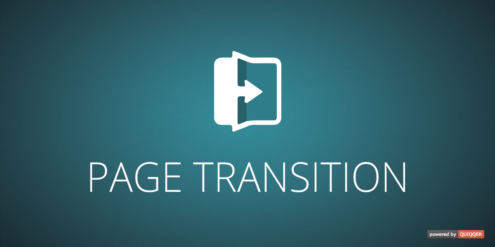

Page Transitions
========

Select between several smooth transitions between your website‘s pages. 
Make your site unique.

Package name:

    quiqqer/page-transition

Features
--------

- Effects at page change

Installation
------------

The package name: quiqqer/page-transition

Contribution
----------

- Issue Tracker: https://dev.quiqqer.com/quiqqer/page-transition/issues
- Source Code: https://dev.quiqqer.com/quiqqer/page-transition/tree/master 

Support
-------

If you have found an error or wish to make improvements, 
please send an e-mail to support@pcsg.de.

Licence
-------

MIT
